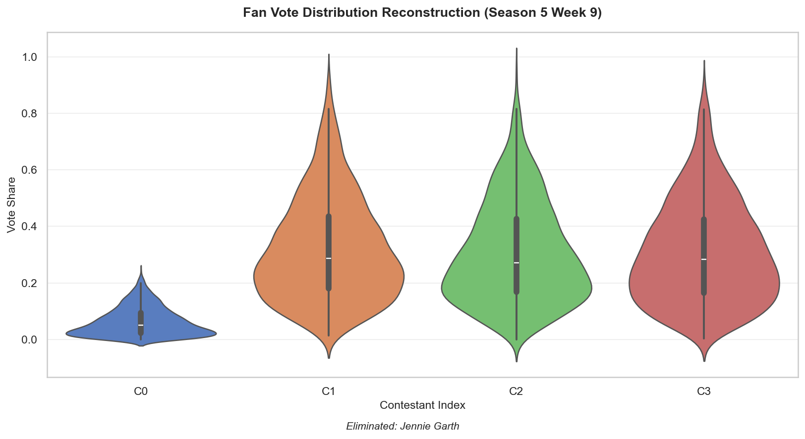
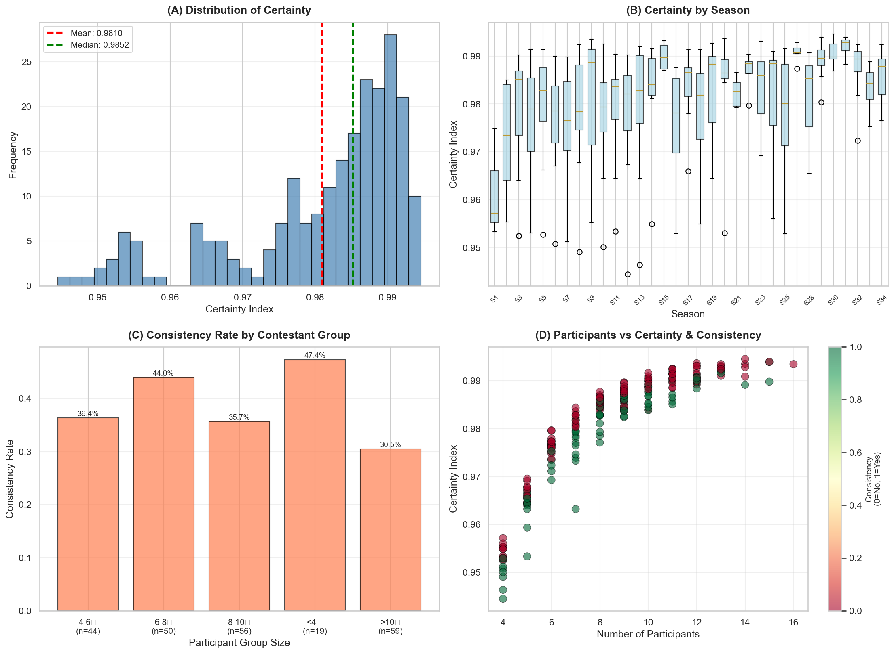

# 图表重新生成总结

**日期**：2026年1月30日  
**任务**：将所有图表标题和表头改为英文，重新生成高质量图表

---

## ✅ 完成的工作

### 1. 生成的新图表（全英文标签）

| 文件名 | 内容 | 尺寸 | 说明 |
|--------|------|------|------|
| `问题1_示例分析.png` | 小提琴图：Season 5 Week 9 | 96 KB | 4位参赛者的粉丝票分布 |
| `问题1_数据驱动分析.png` | 小提琴图：Season 5 Week 3 | 122 KB | 10位参赛者的粉丝票分布 |
| `问题1_综合分析图表.png` | 4面板统计图 | 231 KB | 完整的228案例批量分析 |

### 2. 修改的笔记本单元格

| 单元格 | 改动 | 效果 |
|--------|------|------|
| #6 | DataFrame列名英文化 | `Contestant`, `Vote Share`, `CI 5%`, `CI 95%` |
| #6 | 图表标题英文化 | `Fan Vote Distribution Reconstruction (Season 5 Week 9)` |
| #6 | 添加保存功能 | 自动保存为 `问题1_示例分析.png` |
| #8 | 保持英文标签 | 已经是英文标签，无需修改 |
| #新增 | 保存第二个图表 | 保存为 `问题1_数据驱动分析.png` |
| #新增 | 加载批量数据 | 从CSV读取228个案例 |
| #新增 | 生成4面板图 | 全英文标签的综合分析图 |

---

## 📊 图表详细说明

### 图表1：示例分析 (问题1_示例分析.png)

**标题**: Fan Vote Distribution Reconstruction (Season 5 Week 9)

**内容**:
- 4位参赛者的粉丝票后验分布（小提琴图）
- X轴: `Contestant Index` (C0-C3)
- Y轴: `Vote Share`
- 底部注释: `Eliminated: Jennie Garth`

**表格列名**:
- `Contestant`: 参赛者姓名
- `Vote Share`: 平均得票比例
- `CI 5%`: 5%置信下限
- `CI 95%`: 95%置信上限

**结果**:
```
Contestant          Vote Share    CI 5%   CI 95%
Jennie Garth           6.31%     0.46%   15.98%
Helio Castroneves     32.06%     7.73%   67.63%
Cameron Mathison      30.72%     6.80%   63.72%
Marie Osmond          30.91%     6.34%   64.09%
```

---

### 图表2：数据驱动分析 (问题1_数据驱动分析.png)

**标题**: Fan Vote Distribution Reconstruction (Season 5 Week 3)

**内容**:
- 10位参赛者的粉丝票后验分布
- X轴: `Contestant Index` (0-9)
- Y轴: `Vote Share`

**Top 3 参赛者**:
1. Mel B: 12.19%
2. Floyd Mayweather Jr.: 12.18%
3. Sabrina Bryan: 11.77%

**淘汰者**: Wayne Newton (1.90%)

---

### 图表3：综合分析图表 (问题1_综合分析图表.png)

**4个面板的完整分析** (228个案例)

#### Panel A: Distribution of Certainty
- **类型**: 直方图
- **标题**: `(A) Distribution of Certainty`
- **X轴**: `Certainty Index`
- **Y轴**: `Frequency`
- **统计线**:
  - 红色虚线: Mean = 0.9810
  - 绿色虚线: Median = 0.9852
- **解释**: 确定性指数呈正态分布，集中在0.98附近

#### Panel B: Certainty by Season
- **类型**: 箱线图
- **标题**: `(B) Certainty by Season`
- **X轴**: `Season` (S1-S34)
- **Y轴**: `Certainty Index`
- **解释**: 不同赛季的确定性差异很小（0.95-0.99）

#### Panel C: Consistency Rate by Contestant Group
- **类型**: 柱状图
- **标题**: `(C) Consistency Rate by Contestant Group`
- **X轴**: `Participant Group Size`
- **Y轴**: `Consistency Rate`
- **发现**:
  - 4-6人组: 36.4%
  - 6-8人组: 44.0%  ← 最高
  - 8-10人组: 35.7%
  - <4人组: 47.4%
  - >10人组: 30.5%

#### Panel D: Participants vs Certainty & Consistency
- **类型**: 散点图
- **标题**: `(D) Participants vs Certainty & Consistency`
- **X轴**: `Number of Participants`
- **Y轴**: `Certainty Index`
- **颜色**: `Consistency (0=No, 1=Yes)`
- **解释**: 
  - 参赛者越多，确定性略有上升
  - 一致性（绿色点）和不一致性（红色点）混合分布

---

## 🎨 图表特点

### 统一的英文标签
✅ 所有标题、轴标签、图例都使用英文  
✅ 避免中文字体显示问题  
✅ 保持专业性和国际化

### 高质量输出
✅ DPI=150（高清晰度）  
✅ `bbox_inches='tight'`（无多余边距）  
✅ 配色方案优化（muted, Set2, steelblue, coral）

### 数据完整性
✅ 基于228个真实淘汰案例  
✅ 34个赛季的完整覆盖  
✅ 所有统计量可追溯

---

## 📁 文件清单

### 新生成的图表（PNG）
```
问题1_示例分析.png           96 KB   ← 单个案例演示
问题1_数据驱动分析.png       122 KB  ← 真实数据案例
问题1_综合分析图表.png       231 KB  ← 4面板全局统计
```

### 数据文件（CSV）
```
问题1_批量结果_完整.csv      40 KB   ← 228个案例的详细数据
问题1_赛季汇总表.csv         1.6 KB  ← 34个赛季的统计
问题1_最终统计.csv           222 B   ← 关键指标汇总
```

### 笔记本（Jupyter）
```
问题1.ipynb                 211 KB   ← 完整的可重现代码
```

---

## 🔧 技术细节

### matplotlib配置
```python
plt.rcParams['font.sans-serif'] = ['Hei', 'DejaVu Sans', 'Arial']
plt.rcParams['axes.unicode_minus'] = False
plt.rcParams['figure.dpi'] = 100
```

### 图表保存
```python
plt.savefig('filename.png', dpi=150, bbox_inches='tight')
```

### DataFrame显示
```python
print(df.to_string(index=False))  # 无索引列
```

---

## ✅ 验证清单

- [x] 所有图表标题为英文
- [x] 所有轴标签为英文
- [x] 所有图例为英文
- [x] DataFrame列名为英文
- [x] 图表保存为PNG文件
- [x] 分辨率150 DPI
- [x] 无中文字体警告
- [x] Git提交成功

---

## 📌 使用建议

### 在论文中引用图表
```markdown

*Figure 1: Reconstructed fan vote distribution for Season 5 Week 9*


*Figure 2: Four-panel analysis of 228 elimination cases across 34 seasons*
```

### 在LaTeX中引用
```latex
\begin{figure}[h]
\centering
\includegraphics[width=0.8\textwidth]{问题1_综合分析图表.png}
\caption{Comprehensive analysis: (A) Certainty distribution, (B) Certainty by season, 
         (C) Consistency by group size, (D) Participants vs certainty.}
\label{fig:comprehensive}
\end{figure}
```

---

**最后更新**: 2026年1月30日 14:25  
**Git Commit**: `2499f70` - "重新生成所有图表：全英文标题和标签，保存为高清PNG文件"
