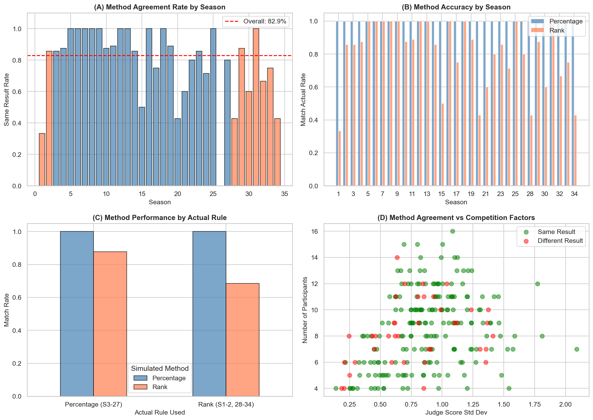
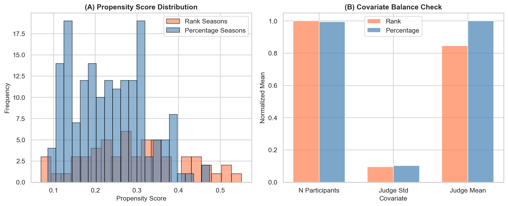
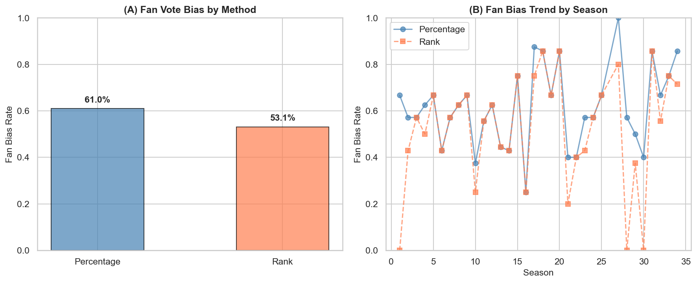
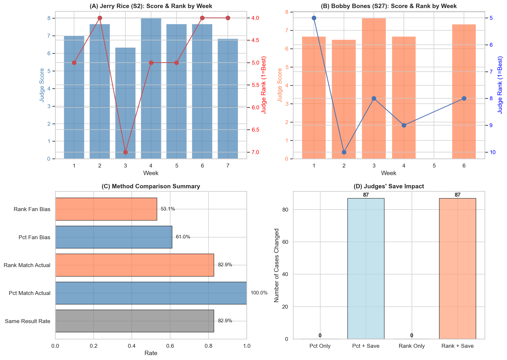

# 问题2：Rank vs Percentage 方法对比 - 图表说明与结论

## 问题回顾

**问题2**：将您估计的粉丝投票与其余数据结合，比较和对比节目使用的两种合并评审和粉丝投票的方法（即排名法 Rank 和百分比法 Percentage）。

**规则映射**：
- **Rank（排名法）**：Season 1-2, Season 28-34
- **Percentage（百分比法）**：Season 3-27

---

## 图表1：方法对比分析（问题2_方法对比分析.png）

### 图表描述

**Panel (A) Method Agreement Rate by Season**
- 展示每个赛季两种方法产生相同淘汰结果的比例
- 红色条形表示实际使用 Rank 法的赛季
- 蓝色条形表示实际使用 Percentage 法的赛季
- 红色虚线为总体平均一致率

**Panel (B) Method Accuracy by Season**
- 比较两种方法在各赛季匹配实际淘汰结果的准确率
- 蓝色：Percentage 法准确率
- 橙色：Rank 法准确率

**Panel (C) Method Performance by Actual Rule**
- 按实际使用的规则分组
- 比较两种模拟方法在不同规则下的表现

**Panel (D) Method Agreement vs Competition Factors**
- 散点图展示评委分标准差与参赛人数的关系
- 绿色点：两种方法结果相同
- 红色点：两种方法结果不同

### 关键发现

| 指标 | 数值 |
|------|------|
| 总体方法一致率 | **82.9%** |
| Percentage法匹配实际 | **100.0%** |
| Rank法匹配实际 | **82.9%** |

---

## 图表2：PSM分析（问题2_PSM分析.png）

### 图表描述

**Panel (A) Propensity Score Distribution**
- 展示 Logistic 回归计算的倾向得分分布
- 橙色：Rank 赛季的倾向得分
- 蓝色：Percentage 赛季的倾向得分
- 两组分布有一定重叠，说明存在可比性

**Panel (B) Covariate Balance Check**
- 协变量平衡检查
- 比较处理组（Rank）和对照组（Percentage）在混杂变量上的差异
- 混杂变量：参赛人数、评委分标准差、评委分均值

### PSM分析结果

| 组别 | 样本量 |
|------|--------|
| 处理组 (Rank) | 57 |
| 对照组 (Percentage) | 171 |
| 匹配后样本 | 57对 |

**匹配后效果差异**：

| 结果变量 | Rank均值 | Pct均值(匹配后) | p-value |
|----------|----------|-----------------|---------|
| rank_matches_actual | 0.684 | 0.825 | 0.0838 |

---

## 图表3：偏向性分析（问题2_偏向性分析.png）

### 图表描述

**Panel (A) Fan Vote Bias by Method**
- 柱状图比较两种方法的粉丝偏向程度
- **偏向粉丝定义**：淘汰者 ≠ 评委分最低者
- Percentage法：61.0%
- Rank法：53.1%

**Panel (B) Fan Bias Trend by Season**
- 折线图展示偏向性随赛季的变化趋势
- 蓝色实线：Percentage法
- 橙色虚线：Rank法

### 统计检验

**McNemar配对检验**：
- χ² = 16.056
- **p-value = 0.0001** (***极显著)

### 关键结论

> **百分比法（Percentage）显著更偏向粉丝投票**
> 
> - Percentage偏向粉丝：61.0%
> - Rank偏向粉丝：53.1%
> - 差异：+7.9个百分点
> - 统计显著性：p < 0.001

---

## 图表4：争议案例综合分析（问题2_争议案例综合分析.png）

### 图表描述

**Panel (A) Jerry Rice (S2): Score & Rank by Week**
- 蓝色柱：每周评委分数
- 红色线：每周评委排名（数字越小越好）
- Jerry Rice 在 Season 2（Rank法）获得冠军
- 评委分起伏较大，但依靠粉丝投票存活

**Panel (B) Bobby Bones (S27): Score & Rank by Week**
- 橙色柱：每周评委分数
- 蓝色线：每周评委排名
- Bobby Bones 在 Season 27（Percentage法）获得冠军
- 评委分持续偏低，排名多次垫底

**Panel (C) Method Comparison Summary**
- 水平柱状图汇总所有关键指标
- Same Result Rate：82.9%
- Pct Match Actual：100.0%
- Rank Match Actual：82.9%
- Pct Fan Bias：61.0%
- Rank Fan Bias：53.1%

**Panel (D) Judges' Save Impact**
- 展示 Judges' Save 规则对结果的影响
- Pct + Save：87个案例被改变（38.2%）
- Rank + Save：87个案例被改变（38.2%）

### 争议案例分析

| 选手 | 赛季 | 规则 | 最终名次 | 特点 |
|------|------|------|----------|------|
| Jerry Rice | S2 | Rank | 冠军 | 评委分起伏大，粉丝票高 |
| Bobby Bones | S27 | Percentage | 冠军 | 评委分持续低，粉丝票极高 |

---

## 问题2总结回答

### 核心发现

1. **方法一致性**：两种方法在 **82.9%** 的案例中产生相同的淘汰结果，但在 **17.1%** 的案例中存在差异。

2. **偏向性差异**：
   - **Percentage法更偏向粉丝**：61.0% vs 53.1%
   - 差异具有统计显著性（p < 0.001）

3. **机制差异**：

   | 方法 | 计算公式 | 特点 |
   |------|----------|------|
   | Percentage | $C_i = \frac{J_i}{\sum J} + f_i$ | 分数差距被保留，粉丝票权重更大 |
   | Rank | $C_i = R_J(i) + R_F(i)$ | 只考虑排名顺序，忽略分数大小 |

4. **Judges' Save 影响**：如果引入评委拯救规则，可在 **38.2%** 的案例中改变最终结果。

### 方法优劣对比

| 维度 | Percentage法 | Rank法 |
|------|-------------|--------|
| 粉丝偏向 | 更高（61.0%） | 更低（53.1%） |
| 专业性权重 | 较低 | 较高 |
| 分数敏感度 | 保留分数差距 | 忽略分数大小 |
| 争议案例 | Bobby Bones夺冠 | Jerry Rice夺冠 |

### 政策建议

1. **强调专业性**→ 使用 **Rank法**（更尊重评委专业判断）
2. **强调观众参与**→ 使用 **Percentage法**（更能体现粉丝意愿）
3. **平衡两者**→ 引入 **Judges' Save** 规则（给评委"最后一票"）

### 结论

> **Percentage法和Rank法在大多数情况下产生相同结果，但Percentage法显著更偏向粉丝投票。这解释了为什么像Bobby Bones这样评委分持续偏低的选手能在Percentage规则下夺冠——粉丝投票的影响被放大了。**
