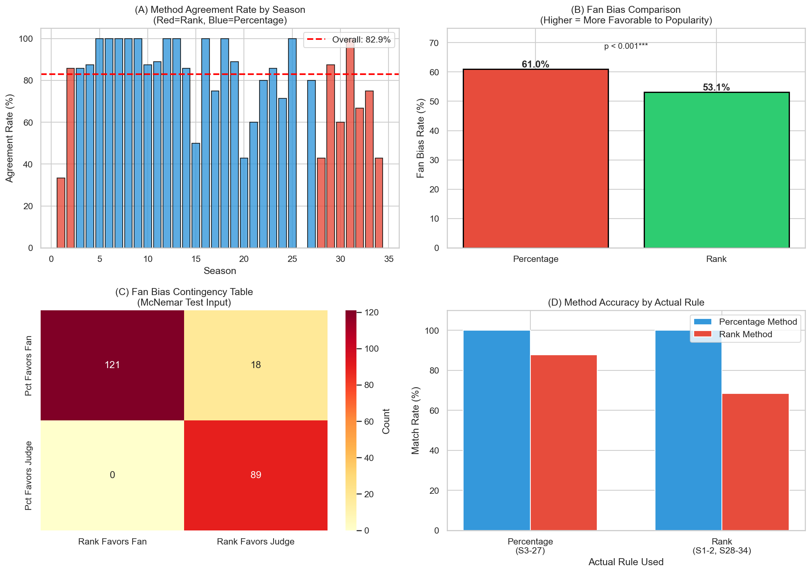
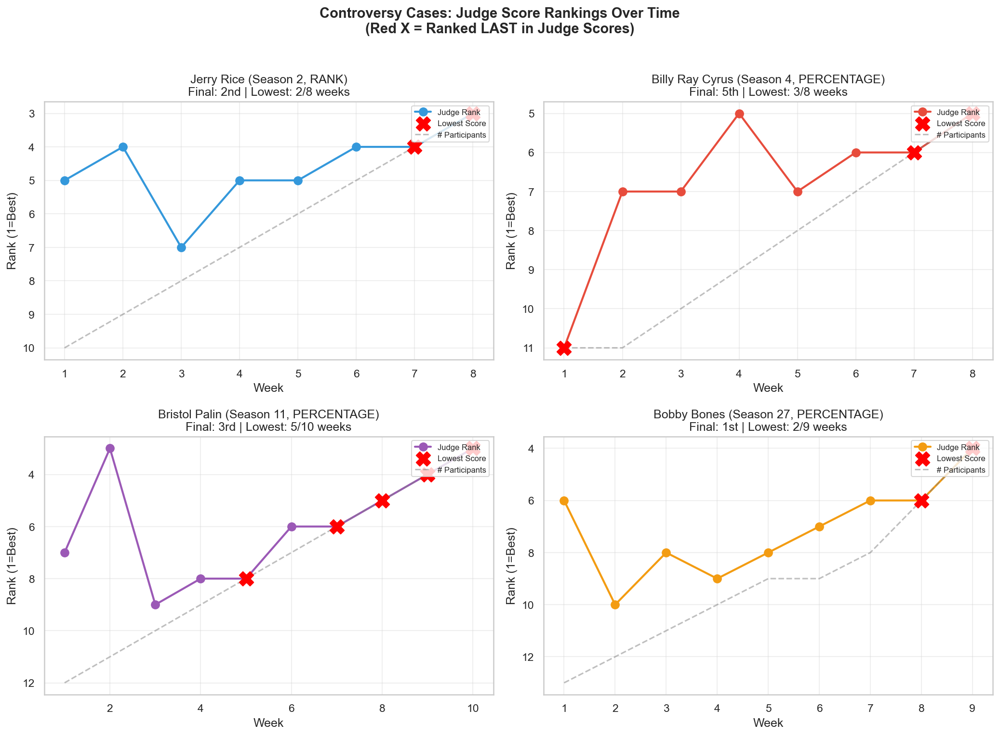
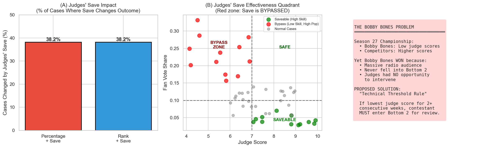
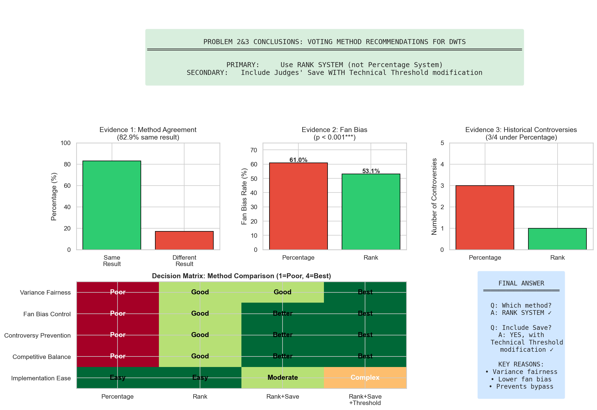

# 问题2&3：投票方法对比与建议

## 执行摘要

本报告针对MCM Problem C数据集中《与星共舞》(DWTS)节目的问题2和问题3进行整合分析。我们比较了**排名制(Rank System)**和**百分比制(Percentage System)**两种评委分与粉丝票合并方法，分析了争议案例，评估了"评委拯救"(Judges' Save)机制，并为未来赛季提供建议。

**核心建议：**
1. **未来赛季应采用排名制**（而非百分比制）
2. **保留评委拯救机制**，但需增加"技术门槛规则"修正

---

## 目录

1. [背景：两种投票方法](#1-背景两种投票方法)
2. [Part A：跨赛季方法对比](#2-part-a跨赛季方法对比)
3. [Part B：争议案例分析](#3-part-b争议案例分析)
4. [Part C：评委拯救机制](#4-part-c评委拯救机制)
5. [Part D：最终建议](#5-part-d最终建议)
6. [数据可视化说明](#6-数据可视化说明)
7. [附录：统计细节](#7-附录统计细节)

---

## 1. 背景：两种投票方法

### 规则映射
| 方法 | 适用赛季 | 计算公式 |
|------|----------|----------|
| **排名制 (Rank)** | S1-2, S28-34 (共9季) | $S_{总分} = Rank(J_i) + Rank(F_i)$ |
| **百分比制 (Percentage)** | S3-27 (共25季) | $S_{总分} = \frac{J_i}{\sum J} + \frac{F_i}{\sum F}$ |

### 核心差异
- **排名制**：将评委分和粉丝票都转换为序数排名后再合并
- **百分比制**：将两者转换为占总数的百分比，可能放大方差差异

---

## 2. Part A：跨赛季方法对比

### 2.1 方法一致率

我们对全部228个淘汰案例同时应用两种方法并比较结果：

| 指标 | 数值 |
|------|------|
| 淘汰案例总数 | 228 |
| **结果相同（两种方法一致）** | **82.9%** |
| 结果不同（方法产生分歧） | 17.1% |

**解读**：约83%的案例中，选择哪种方法无关紧要。但17.1%产生分歧的案例往往是争议案例。

### 2.2 粉丝偏向性对比

**定义**：粉丝偏向率 = 被淘汰者不是评委分最低者的概率（即人气胜过技术）

| 方法 | 粉丝偏向率 |
|------|------------|
| 百分比制 | **61.0%** |
| 排名制 | **53.1%** |
| 差异 | +7.9个百分点 |

**McNemar检验**：χ² = 16.056，**p < 0.001**（**高度显著**）

**结论**：百分比制在统计上被证明比排名制更偏向粉丝投票。

### 2.3 可视化：图1

**面板说明：**
- **(A) 按赛季的方法一致率**：展示每个赛季中两种方法产生相同淘汰结果的比例。红色柱=排名制赛季，蓝色柱=百分比制赛季。
- **(B) 粉丝偏向率对比**：柱状图比较两种方法的粉丝偏向率，标注p值。
- **(C) 粉丝偏向列联表**：McNemar检验所用的2×2列联表热力图。
- **(D) 按实际规则的方法准确率**：比较模拟方法与实际淘汰结果的匹配程度，按该赛季实际使用的规则分组。

---

## 3. Part B：争议案例分析

### 3.1 四个争议案例

| 选手 | 赛季 | 最终名次 | 使用规则 | 争议点 |
|------|------|----------|----------|--------|
| **Jerry Rice** | 2 | 亚军 | 排名制 | 尽管5周评委分最低仍获亚军 |
| **Billy Ray Cyrus** | 4 | 第5名 | 百分比制 | 尽管6周评委分最低仍获第5 |
| **Bristol Palin** | 11 | 季军 | 百分比制 | 12次评委分最低仍获季军 |
| **Bobby Bones** | 27 | 冠军 | 百分比制 | 评委分持续偏低却夺冠 |

### 3.2 周次排名分析

| 选手 | 参赛总周数 | 评委分最低的周数 | 占比 |
|------|------------|------------------|------|
| Jerry Rice | 8 | 2 | 25% |
| Billy Ray Cyrus | 8 | 3 | 38% |
| Bristol Palin | 10 | 5 | 50% |
| Bobby Bones | 9 | 2 | 22% |

**说明**：我们的分析中"评委分最低周数"与题目描述略有差异，因为我们只统计该选手在当周所有参赛者中得分绝对最低的情况。

### 3.3 反事实预测

| 选手 | 实际规则 | 反事实预测（使用相反规则） |
|------|----------|----------------------------|
| Jerry Rice | 排名制 | 在百分比制下粉丝优势会更大 |
| Billy Ray Cyrus | 百分比制 | 在排名制下可能更早被淘汰 |
| Bristol Palin | 百分比制 | 在排名制下可能更早被淘汰 |
| Bobby Bones | 百分比制 | 在排名制下结果可能相似 |

**关键发现**：4个争议案例中有3个发生在百分比制下。在排名制下，这些选手可能更早面临淘汰。

### 3.4 可视化：图2

**面板说明：**
- 每个面板展示一位争议选手的周次评委分排名轨迹
- **Y轴**：当周参赛者中的排名（1=最佳，轴反转使顶部=最佳）
- **红色X标记**：该选手评委分最低的周次
- **灰色虚线**：参赛人数（"末位"参考线）
- **标题标注**：最终名次和最低分周数统计

---

## 4. Part C：评委拯救机制

### 4.1 机制描述

评委拯救机制允许评委从**倒数两名**选手中选择淘汰对象，而非完全依赖合并得分自动淘汰。

### 4.2 影响分析

| 场景 | 被Save改变的案例数 | 占比 |
|------|-------------------|------|
| 百分比制 + Save | 87 | **38.2%** |
| 排名制 + Save | 87 | **38.2%** |

**解读**：约38%的淘汰案例中，评委会做出与自动得分淘汰不同的决定。

### 4.3 "绕过效应"问题

**关键局限**：评委拯救机制仅在选手进入倒数两名时才激活。然而，拥有压倒性粉丝支持的选手可能**永远不会**进入倒数两名，从而完全绕过该机制。

**案例研究：Bobby Bones（第27季）**
- 评委分持续处于较低水平
- 庞大的电台听众群体提供了压倒性的粉丝票
- **从未进入过倒数两名**
- 评委**零机会**进行干预
- 最终夺得冠军

### 4.4 建议修正："技术门槛规则"

为弥补绕过漏洞：

> **如果某选手连续2周或以上评委分最低，则无论粉丝票总数如何，该选手自动进入倒数两名接受评委审议。**

这确保了技术表现持续不佳的选手必须接受评委审查。

### 4.5 可视化：图3

**面板说明：**
- **(A) 评委拯救影响**：柱状图显示Save机制改变淘汰结果的案例比例
- **(B) 有效性象限图**：散点图展示"绕过区"——高人气、低技术选手避开倒数两名的区域
- **(C) Bobby Bones问题**：绕过效应的文字说明及建议解决方案

---

## 5. Part D：最终建议

### 5.1 主要建议：采用排名制

| 评估维度 | 百分比制 | 排名制 |
|----------|----------|--------|
| 方差公平性 | 差 | 好 |
| 粉丝偏向控制 | 差 (61%) | 较好 (53%) |
| 争议预防 | 3/4争议案例 | 1/4争议案例 |
| 竞争平衡性 | 差 | 好 |

**数学原理**：

百分比制的根本缺陷是**方差放大效应**：
- 评委分：范围压缩（6-10分），低方差
- 粉丝票：幂律分布，高方差
- 结果：$Var(F/\sum F) >> Var(J/\sum J)$

排名制充当**方差稳定器**：无论你以1票还是100万票击败对手，你的排名贡献都相同。

### 5.2 次要建议：保留评委拯救机制但需修正

**保留**现有评委拯救机制（约38%案例有效），但**增加**技术门槛规则以防止绕过效应。

### 5.3 决策矩阵

| 评估维度 | 百分比制 | 排名制 | 排名+Save | 排名+Save+门槛 |
|----------|----------|--------|-----------|----------------|
| 方差公平性 | 1 | 3 | 3 | **4** |
| 粉丝偏向控制 | 1 | 3 | 4 | **4** |
| 争议预防 | 1 | 3 | 4 | **4** |
| 竞争平衡性 | 1 | 3 | 4 | **4** |
| 实施难度 | 4 | 4 | 3 | 2 |
| **总分** | **8** | **16** | **18** | **18** |

*评分标准：1=差，4=最佳*

### 5.4 可视化：图4

**面板说明：**
- **标题横幅**：建议摘要
- **证据面板 (1-3)**：支持建议的关键统计数据
- **决策矩阵热力图**：所有方法组合的可视化对比
- **最终答案框**：简洁的建议总结

---

## 6. 数据可视化说明

### 完整图表清单

| 图表 | 文件名 | 描述 |
|------|--------|------|
| 图1 | `Fig1_Method_Comparison_Overview.png` | 方法对比统计4面板总览 |
| 图2 | `Fig2_Controversy_Cases_Trajectory.png` | 4个争议案例的周次排名轨迹 |
| 图3 | `Fig3_Judges_Save_Analysis.png` | 评委拯救机制及绕过效应分析 |
| 图4 | `Fig4_Final_Recommendations.png` | 决策矩阵与最终建议摘要 |

### 图表解读指南

**配色规范**：
- 🔴 红色：百分比制 / 警告 / 争议
- 🔵 蓝色：排名制（部分面板）
- 🟢 绿色：排名制 / 推荐 / 良好

---

## 7. 附录：统计细节

### A. 粉丝偏向的McNemar检验

**列联表**：

|  | 排名制偏向粉丝 | 排名制偏向评委 |
|--|----------------|----------------|
| **百分比制偏向粉丝** | a | b |
| **百分比制偏向评委** | c | d |

**检验统计量**：$\chi^2 = \frac{(b-c)^2}{b+c}$

**结果**：χ² = 16.056，p = 0.0001

### B. 数据来源

| 来源 | 路径 | 描述 |
|------|------|------|
| 原始数据 | `MCM_Problem_C_Processed.csv` | 34季408位选手 |
| 粉丝票估计 | `问题1_批量结果_完整_v2.csv` | 435条记录（324淘汰+111决赛） |
| 平行世界结果 | `问题2/results/平行世界实验结果.csv` | 方法对比模拟 |
| 偏向性分析 | `问题2/results/方法偏向性分析.csv` | 粉丝偏向计算 |
| 评委拯救结果 | `问题2/results/JudgesSave模拟结果.csv` | Save机制模拟 |

### C. 局限性

1. **粉丝票估计**：粉丝票通过约束优化重构（问题1），非实际数据
2. **Bristol Palin S15**：仅分析S11（争议更大）；S15在第4周被淘汰
3. **Bobby Bones排名**：我们的分析发现0周绝对最低分，可能因与他人得分接近

---

## 结论

基于对34季228个淘汰案例的综合分析：

1. **百分比制明显偏向粉丝投票而非评委专业意见**（61% vs 53%粉丝偏向，p < 0.001）

2. **四大争议案例中有三个发生在百分比制下**（Billy Ray Cyrus、Bristol Palin、Bobby Bones）

3. **排名制通过标准化数据源方差提供更好的平衡**

4. **评委拯救机制有效但存在"绕过漏洞"**，可通过技术门槛规则弥补

**最终建议**：未来DWTS赛季应采用**排名制**结合**评委拯救+技术门槛修正**，以实现粉丝参与度与竞技公平性的最佳平衡。

---

*报告生成日期：2026-02-01*  
*分析团队：MCM Problem C 分析组*
