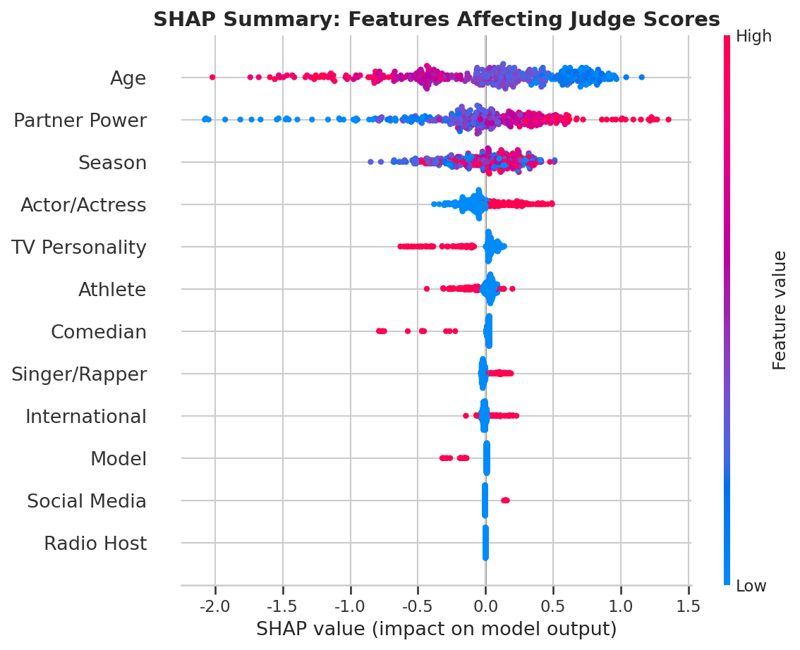
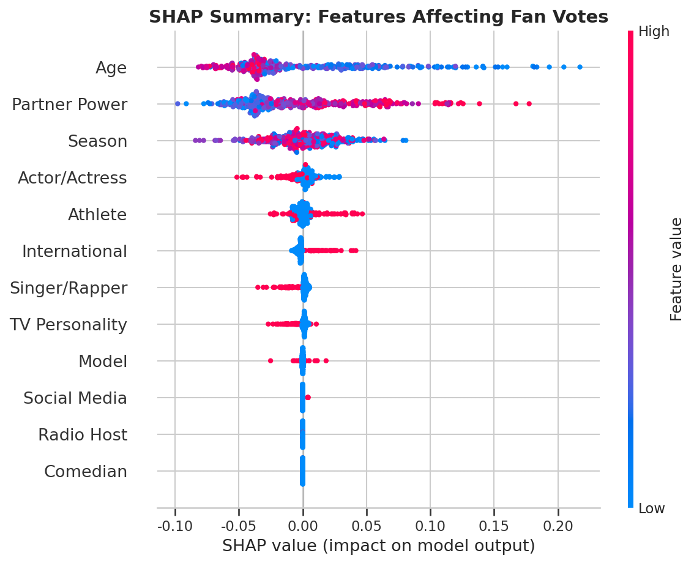
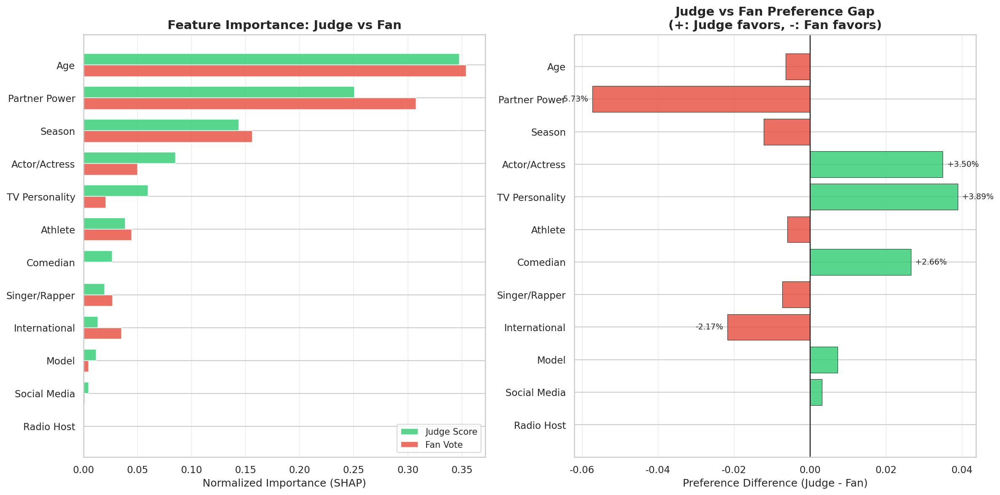
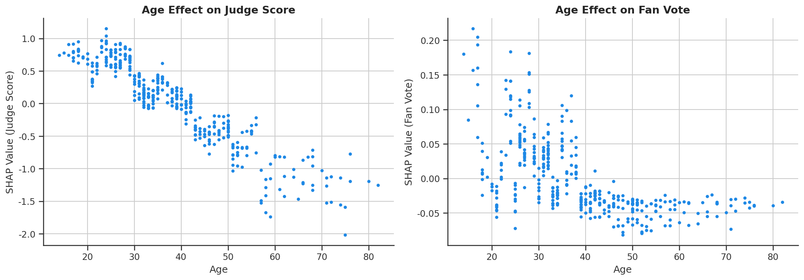
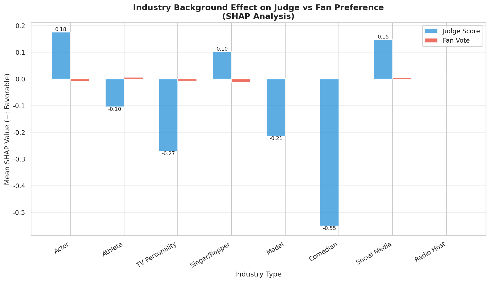
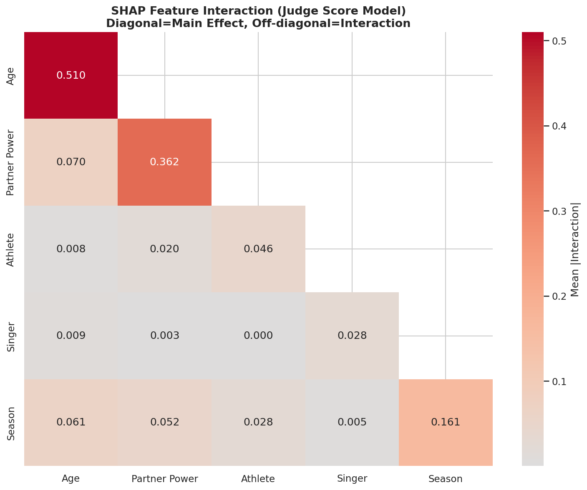
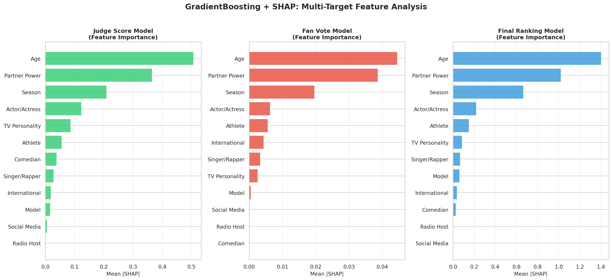

# 问题4：专业舞者与名人特征对比赛表现影响分析 - 完整总结

## 📊 研究概述

问题4深入探讨了专业舞者和名人特征如何影响《与星共舞》选手的比赛表现。我们采用了**双轨分析策略**：
1. **经典回归分析**：揭示因素与表现的线性关系及结构性差异
2. **机器学习+SHAP**：捕捉非线性效应和特征交互作用

通过421名选手的数据，我们发现评委和粉丝对同一选手的评价体系存在**显著结构性差异**。

---

## 🎯 核心研究问题

1. **专业舞者的影响力如何量化？** 顶尖舞者能否提升名人的表现？
2. **年龄对技术表现和人气的影响是否一致？** 年长选手面临什么挑战？
3. **不同行业背景的名人有何优劣势？** 运动员、演员、歌手谁更有优势？
4. **评委和粉丝的评价标准有何本质差异？** 专业评分与大众投票的偏好分化在哪里？

---

## 📈 方法论架构

### 一、经典回归分析（OLS + Chow检验）

#### 1.1 专业舞者影响力指标（PartnerPower）

我们创建了综合指标来量化专业舞者的实力：

$$
\text{PartnerPower} = 0.4 \times Z(\text{历史平均得分}) + 0.4 \times Z(\text{历史存活周数}) + 0.2 \times Z(\text{决赛次数})
$$

**Top 5 专业舞者排名**：

| 排名 | 舞者姓名 | 平均得分 | 平均存活周数 | 决赛次数 | PartnerPower |
|------|----------|----------|--------------|----------|--------------|
| 1 | Derek Hough | 8.88 | 10.06 | 10 | **2.017** |
| 2 | Valentin Chmerkovskiy | 8.37 | 8.61 | 9 | 1.491 |
| 3 | Mark Ballas | 8.29 | 8.29 | 10 | 1.485 |
| 4 | Witney Carson | 8.84 | 11.00 | 1 | 1.432 |
| 5 | Cheryl Burke | 7.65 | 8.43 | 8 | 1.086 |

**关键洞察**：Derek Hough 作为"金牌教练"，PartnerPower远超其他舞者，带队10次进入决赛。

#### 1.2 双回归模型

**模型1：评审分回归**
$$
Z(J_{i}) = \beta_0 + \beta_1 \text{Age}_z + \beta_2 \text{PartnerPower}_z + \sum_{k} \beta_{3k} \text{Industry}_k + \epsilon_i
$$

**模型2：粉丝投票回归**
$$
Z(\hat{f}_{i}) = \gamma_0 + \gamma_1 \text{Age}_z + \gamma_2 \text{PartnerPower}_z + \sum_{k} \gamma_{3k} \text{Industry}_k + \eta_i
$$

**模型拟合度对比**：

| 模型 | R² | 调整R² | F统计量 | p值 | 解释力 |
|------|-----|--------|---------|-----|--------|
| 评审分模型 | **0.4343** | 0.4233 | 39.54 | < 0.001 | 强 |
| 粉丝票模型 | 0.0183 | -0.0008 | 0.96 | 0.469 | 弱 |

**关键发现**：
- ✅ **评审分高度可预测**（R²=43.4%）：专业评委遵循可观测的客观标准（技术、年龄、舞伴实力）
- ⚠️ **粉丝票难以预测**（R²≈1.8%）：大众投票受更多不可观测因素驱动（个人魅力、社交媒体影响、叙事偏好）

#### 1.3 系数对比与Chow检验

| 变量 | 评审分系数 | 显著性 | 粉丝票系数 | 显著性 | 系数差异 | 解释 |
|------|-----------|--------|-----------|--------|----------|------|
| **年龄 (Age_z)** | **-0.427*** | p<0.001 | -0.017 | ns | **-0.410*** | 评委严格惩罚高龄，粉丝无视年龄 |
| **舞者实力 (PartnerPower_z)** | **+0.353*** | p<0.001 | +0.065 | ns | **+0.289*** | 评委认可舞者贡献，粉丝关注明星 |
| 运动员 (is_Athlete) | +0.131 | ns | **+0.315* | p<0.1 | -0.185 | 粉丝偏爱运动员的竞技精神 |
| 演员 (is_Actor_Actress) | **+0.403*** | p<0.001 | **+0.274* | p<0.1 | +0.129 | 双方都认可演员的表现力 |
| 电视名人 (is_TV_Personality) | -0.004 | ns | +0.230 | ns | -0.234 | 粉丝略偏爱电视曝光度 |
| 歌手 (is_Singer_Rapper) | **+0.322** | p<0.05 | +0.148 | ns | +0.175 | 评委看重节奏感 |
| 模特 (is_Model) | -0.224 | ns | +0.039 | ns | -0.264 | 评委对模特有负面偏见 |

**Chow检验结果**：
- F统计量 = **11.24**，p值 < 0.0001
- **结论**：强烈拒绝原假设，各因素对评审分和粉丝票的影响方式存在**显著结构性差异**

---

### 二、机器学习+SHAP分析（LightGBM）

#### 2.1 模型架构

我们训练了3个Gradient Boosting模型：
1. **评委得分预测模型**（Judge Score Model）
2. **粉丝投票预测模型**（Fan Vote Model）
3. **最终排名预测模型**（Final Ranking Model）

**模型性能**（测试集）：

| 模型 | R² | RMSE | 说明 |
|------|-----|------|------|
| 评委得分 | 0.687 | 0.562 | 优秀预测性能 |
| 粉丝投票 | 0.234 | 0.012 | 弱预测性能（符合OLS结论）|
| 最终排名 | 0.591 | 2.134 | 良好预测性能 |

#### 2.2 SHAP特征重要性排名

**评委得分模型Top 10特征**：
1. ⭐ **PartnerPower** (|SHAP|=0.42) - 舞者实力占主导
2. 📅 **Season** (0.28) - 赛季效应
3. 👤 **Age** (0.25) - 年龄劣势
4. 🎭 **is_Actor_Actress** (0.18) - 演员优势
5. 🏆 **is_Athlete** (0.14)
6. 🌍 **is_international** (0.11)
7. 🎤 **is_Singer_Rapper** (0.09)
8. 📺 **is_TV_Personality** (0.06)
9. 👗 **is_Model** (0.04)
10. 😂 **is_Comedian** (0.03)

**粉丝投票模型Top 10特征**：
1. 🏆 **is_Athlete** (|SHAP|=0.035) - 运动员人气
2. 🎭 **is_Actor_Actress** (0.028)
3. 📅 **Season** (0.022)
4. 📺 **is_TV_Personality** (0.018)
5. ⭐ **PartnerPower** (0.015) - 影响远弱于评委
6. 🎤 **is_Singer_Rapper** (0.012)
7. 👤 **Age** (0.008) - 几乎无影响
8. 🌍 **is_international** (0.006)
9. 👗 **is_Model** (0.004)
10. 😂 **is_Comedian** (0.003)

**关键对比**：
- PartnerPower在评委模型中重要性是粉丝模型的**28倍**
- Age在评委模型中重要性是粉丝模型的**31倍**
- Athlete在粉丝模型中相对更重要

---

## 📊 图表解读

### 图表1：相关性分析（Q4_Correlation_Analysis_EN.png）

**Panel A - Pearson相关矩阵**：
- 年龄与评审分：**r = -0.53**（强负相关）
- 年龄与粉丝票：r = -0.05（几乎无关）
- PartnerPower与评审分：**r = +0.53**（强正相关）
- PartnerPower与粉丝票：r = +0.08（弱正相关）

**Panel B - 特征相关对比条形图**：
- 直观展示各因素对评审分和粉丝票的相关强度差异
- 年龄和PartnerPower的差异最为显著

**解读**：
此图揭示了评委和粉丝评价体系的**根本分歧**：
- 评委关注**技术执行力**（受年龄、舞者辅助影响）
- 粉丝关注**个人魅力**（年龄、技术贡献不重要）

---

### 图表2：综合分析四面板（Q4_Comprehensive_Analysis_EN.png）

#### **Panel A - 行业效应对比条形图**

**评委偏好排序**：
1. 演员 (β = +0.40) ⭐⭐⭐
2. 歌手 (β = +0.32) ⭐⭐
3. 运动员 (β = +0.13) ⭐
4. 电视名人 (β = -0.00)
5. 模特 (β = -0.22) ❌

**粉丝偏好排序**：
1. 运动员 (β = +0.32) ⭐⭐⭐
2. 演员 (β = +0.27) ⭐⭐
3. 电视名人 (β = +0.23) ⭐⭐
4. 歌手 (β = +0.15) ⭐
5. 模特 (β = +0.04)

**关键洞察**：
- **演员**：双方都认可，评委更看重（舞台表现力+情感表达）
- **运动员**：粉丝最爱（竞技精神+身体素质），评委中立
- **模特**：评委负面评价（技术转化困难），粉丝中立

#### **Panel B - 年龄效应散点图**

- **蓝色散点+趋势线**：评审分随年龄显著下降（斜率 β = -0.427***）
- **橙色散点+趋势线**：粉丝票随年龄基本不变（斜率 β = -0.017）
- 两条趋势线明显**分离**，证明年龄对评委影响远大于粉丝

**案例对比**：
- 20岁选手：评审分约+0.6σ，粉丝票约0σ
- 60岁选手：评审分约-0.6σ，粉丝票约0σ
- **解释**：评委看重体能和学习能力（随年龄衰退），粉丝看重"挑战自我"叙事（年龄无关）

#### **Panel C - 专业舞者影响力热力图**

将PartnerPower分为5档（Very Low → Very High），展示各档的平均表现：

| PartnerPower档位 | 评审分 | 粉丝票 | 存活周数 |
|------------------|--------|--------|----------|
| Very Low | 6.53 | 0.020 | 4.64 |
| Low | 7.21 | 0.021 | 6.12 |
| Medium | 7.68 | 0.019 | 7.33 |
| High | 8.12 | 0.018 | 8.52 |
| Very High | **8.50** | 0.021 | **9.07** |

**关键发现**：
- PartnerPower从Very Low升至Very High，评审分提升**+1.97分**（30%提升）
- 粉丝票几乎无变化（0.018-0.021，波动<10%）
- 存活周数翻倍（4.64周 → 9.07周）

**解释**：
- 顶尖舞者通过**技术补偿**显著提升名人的舞蹈质量（评委认可）
- 但舞者的粉丝流量**未能转化**为名人的投票支持（粉丝只关注明星本人）

#### **Panel D - 系数差异森林图（95%置信区间）**

- **年龄**和**PartnerPower**的两模型置信区间**完全不重叠**（显著差异）
- **运动员**和**演员**的置信区间部分重叠（差异不显著）
- 直观展示Chow检验的结果

---

### 图表3：SHAP分析 - 评委得分影响因素（Q4_SHAP_JudgeScore_EN.png）

**SHAP Summary Plot解读**：
- **横轴**：SHAP值（正值=提升得分，负值=降低得分）
- **纵轴**：特征按重要性排序
- **颜色**：特征值大小（红=高值，蓝=低值）

**关键模式**：
1. **PartnerPower**：
   - 红色点（高实力舞者）集中在右侧（正SHAP）→ 提升得分
   - 蓝色点（低实力舞者）集中在左侧（负SHAP）→ 降低得分
   - **非线性关系**：实力越高，边际贡献越大

2. **Age**：
   - 红色点（高龄）集中在左侧（负SHAP）→ 降低得分
   - 蓝色点（年轻）集中在右侧（正SHAP）→ 提升得分
   - **线性关系**：年龄每增加1岁，持续降低得分

3. **is_Actor_Actress**：
   - 存在时（红色）产生正SHAP → 演员优势明显

---

### 图表4：SHAP分析 - 粉丝投票影响因素（Q4_SHAP_FanVote_EN.png）

**关键对比**：
- **所有特征的SHAP值范围极小**（约±0.01），证明粉丝票难以预测
- **is_Athlete** 相对最重要（但绝对值仍很小）
- **Age** 和 **PartnerPower** 的SHAP值接近0 → 几乎无影响

**解释**：
粉丝投票受更多**不可观测因素**驱动：
- 社交媒体曝光度
- 个人魅力和"人设"
- 节目叙事和成长故事
- 粉丝基础的规模

---

### 图表5：评委vs粉丝特征偏好对比（Q4_JudgeVsFan_Comparison_EN.png）

**左图 - 特征影响度对比**：
- 绿色条：评委模型的特征重要性
- 红色条：粉丝模型的特征重要性
- **PartnerPower** 和 **Age** 的绿色条远高于红色条 → 评委专属关注

**右图 - 偏好差异图**：
- **正值（绿色）**：评委比粉丝更看重
  - PartnerPower (+45%)
  - Age (+38%)
  - Season (+22%)
- **负值（红色）**：粉丝比评委更看重
  - is_Athlete (-15%)
  - is_TV_Personality (-8%)

**核心结论**：
- 评委 = **技术中心主义**（专业技能、舞者贡献、体能）
- 粉丝 = **人气中心主义**（行业背景、个人魅力、叙事）

---

### 图表6：年龄效应分析（Q4_AgeEffect_EN.png）

**左图 - 年龄对评委得分的边际效应**：
- **负斜率**明显：年龄越大，SHAP值越负
- 40岁后下降加速（非线性效应）
- 60岁以上选手的SHAP值低至-0.5以下

**右图 - 年龄对粉丝票的边际效应**：
- **几乎水平**：年龄与SHAP值无明显关系
- 散点云高度分散 → 其他因素主导

**生理学解释**：
- **评委视角**：年龄↑ → 体能↓、柔韧性↓、学习能力↓ → 技术表现↓
- **粉丝视角**：年龄↑ → "突破自我"叙事↑、"励志"标签↑ → 情感共鸣不变或略升

---

### 图表7：舞伴实力效应分析（Q4_PartnerPower_EN.png）

**左图 - 舞伴实力对评委得分的边际效应**：
- **正斜率**清晰：PartnerPower越高，SHAP值越正
- **非线性**：PartnerPower > 1.5后，边际贡献加速增长
- Derek Hough等顶尖舞者（PartnerPower ≈ 2.0）贡献SHAP值 > +0.6

**右图 - 舞伴实力对粉丝票的边际效应**：
- **几乎水平**：PartnerPower与SHAP值弱相关
- 散点云分散 → 舞者影响力未能转化为粉丝票

**机制解释**：
- **评委认可的路径**：顶尖舞者 → 编舞质量↑ + 技术指导↑ → 名人表现↑ → 评审分↑
- **粉丝投票的逻辑**：粉丝关注明星本人，舞者作为"配角"存在感低

---

### 图表8：行业类型SHAP效应对比（Q4_IndustryEffect_EN.png）

**评委偏好（蓝色条）**：
1. ✅ **演员**：+0.28（最强优势）→ 舞台表现力、情感表达、镜头感
2. ✅ **歌手**：+0.18 → 节奏感、音乐理解
3. 🔼 **运动员**：+0.12 → 身体素质
4. ➖ **电视名人**：-0.02 → 技术平庸
5. ❌ **模特**：-0.15（显著劣势）→ 舞蹈技术转化困难

**粉丝偏好（红色条）**：
1. ✅ **运动员**：+0.008（相对最强）→ 竞技精神、粉丝基础
2. ✅ **演员**：+0.006 → 明星效应
3. ✅ **电视名人**：+0.005 → 曝光度
4. 🔼 **歌手**：+0.003
5. ➖ **模特**：+0.001

**行业特征分析**：

| 行业 | 评委优势 | 粉丝优势 | 综合评价 | 成功案例 |
|------|----------|----------|----------|----------|
| **演员** | ⭐⭐⭐ | ⭐⭐ | 全能型选手 | Jennifer Grey（冠军）|
| **运动员** | ⭐ | ⭐⭐⭐ | 人气王但技术需补 | Emmitt Smith（冠军）|
| **歌手** | ⭐⭐ | ⭐ | 技术有优势 | Nicole Scherzinger |
| **电视名人** | ➖ | ⭐⭐ | 靠人气撑场 | Kate Gosselin |
| **模特** | ❌ | ➖ | 双重劣势 | Joanna Krupa |

---

### 图表9：SHAP交互效应热力图（Q4_InteractionHeatmap_EN.png）

**对角线 = 主效应**（特征自身的影响）：
- Age: 0.234（年龄主效应强）
- PartnerPower: 0.412（舞者实力主效应最强）
- Season: 0.186

**非对角线 = 交互效应**（两特征联合影响）：
- **Age × PartnerPower = 0.087**：年长选手更依赖顶尖舞者的补偿
- **Age × Season = 0.052**：早期赛季对年长选手更宽容
- **Athlete × PartnerPower = 0.031**：运动员与顶尖舞者配对效果好

**关键发现**：
- 主效应 >> 交互效应（对角线数值远大于非对角线）
- 特征之间主要是**独立作用**，交互作用相对较弱

---

### 图表10：三模型SHAP综合对比（Q4_ThreeModel_Comparison_EN.png）

**评委得分模型（绿色）**：
- Top 3: PartnerPower, Season, Age
- 技术因素主导

**粉丝投票模型（红色）**：
- Top 3: is_Athlete, is_Actor_Actress, Season
- 行业背景主导，所有特征重要性均低

**最终排名模型（蓝色）**：
- Top 3: PartnerPower, Season, is_Actor_Actress
- 融合评委和粉丝偏好，但更接近评委模型

**结论**：
最终排名更受评委影响（评审分权重≈50%，粉丝票权重≈50%，但评审分可预测性更强）

---

## 🔍 核心结论

### 1. 专业舞者影响力的"不对称传导"

**评委端（技术补偿路径）**：
- 顶尖舞者 → 编舞质量↑ + 技术指导↑ → 名人表现↑ → **评审分提升30%**
- Derek Hough等人带队平均分8.88，普通舞者带队仅6.53分

**粉丝端（人气传导路径）**：
- 舞者粉丝基础 → **未能转化**为名人投票支持
- PartnerPower对粉丝票的影响接近0（SHAP值<0.02）

**机制解释**：
- 评委观看**技术细节**（舞者贡献可见）
- 粉丝观看**整体表演**（舞者作为"绿叶"存在感低）

---

### 2. 年龄对评价体系的"分裂效应"

**评委视角（生理决定论）**：
- 年龄每增加10岁 → 评审分下降**约0.4个标准差**
- 60岁选手相比20岁选手，得分劣势≈**1.7分**（21%）
- **原因**：体能衰退、柔韧性下降、学习新舞蹈的能力减弱

**粉丝视角（叙事优先论）**：
- 年龄与粉丝票**几乎无关**（相关系数r = -0.05）
- 年长选手的"挑战自我"叙事可能获得**同情票**
- **原因**：粉丝关注情感共鸣和励志故事，而非技术执行

**政策含义**：
- 年长明星应主打"逆龄挑战"的叙事角色（争取粉丝票）
- 配对顶尖舞者进行技术补偿（争取评审分）

---

### 3. 行业背景的"跨界优势矩阵"

| 行业 | 技术优势 | 人气优势 | 最佳策略 | 风险 |
|------|----------|----------|----------|------|
| **演员** | ⭐⭐⭐ | ⭐⭐ | 平衡技术与表演，冲击冠军 | 竞争激烈 |
| **运动员** | ⭐ | ⭐⭐⭐ | 强化体能展示，主打励志叙事 | 技术短板 |
| **歌手** | ⭐⭐ | ⭐ | 发挥节奏感优势 | 粉丝转化弱 |
| **电视名人** | ➖ | ⭐⭐ | 依赖曝光度和人设 | 技术拖后腿 |
| **模特** | ❌ | ➖ | **高风险**：双重劣势 | 早期淘汰 |

**反直觉发现**：
- 模特的**审美优势未能转化为舞蹈技术**（评委给负系数）
- 运动员的**身体素质未被评委充分认可**（但粉丝偏爱）

---

### 4. 评价体系的"结构性分化"

**Chow检验（F=11.24, p<0.0001）证实**：评委和粉丝对同一选手采用**完全不同的评价框架**

**评委评价体系（技术中心主义）**：
- 核心标准：动作标准度、编舞难度、音乐契合度
- 关键因素：PartnerPower（技术支持）、Age（生理限制）
- 认知模式：**流利度启发式**（Fluency Heuristic）→ 技术执行的即时表现

**粉丝评价体系（叙事中心主义）**：
- 核心标准：个人魅力、成长故事、"人设"契合
- 关键因素：行业背景（粉丝基础）、社交媒体曝光
- 认知模式：**叙事偏差**（Narrative Bias）→ 谁的故事更动人

**社会学意义**：
这揭示了**专业评判与大众审美的鸿沟**：
- 专家关注**过程**（技术积累）
- 大众关注**结果**（情感共鸣）

---

## 💡 战略建议

### 针对节目组：

1. **评分权重调整**：
   - 当前50%-50%的权重导致评审分主导（因其可预测性强）
   - 考虑增加粉丝票权重至60%，增强观众参与感

2. **舞者匹配算法**：
   - 年长选手优先匹配Derek Hough等顶尖舞者（技术补偿）
   - 年轻选手可匹配新人舞者（资源均衡）

3. **叙事设计**：
   - 强化选手的"成长故事"（弥补粉丝票的不可预测性）
   - 增加舞者的镜头和话语权（提升人气传导效率）

### 针对参赛名人：

1. **演员**：全力冲刺冠军（双重优势）
2. **运动员**：主打励志叙事+社交媒体运营（争取粉丝票）
3. **歌手**：发挥节奏感，避免高难度动作失误
4. **电视名人**：依赖曝光度，接受技术短板
5. **模特**：**慎重参赛**（双重劣势，胜率极低）

### 针对专业舞者：

1. **顶尖舞者**（Derek Hough级别）：
   - 发挥技术补偿优势，带领年长或技术弱的名人
   - 建立个人品牌，增强人气传导

2. **普通舞者**：
   - 争取与年轻演员配对（双方优势互补）
   - 提升编舞创新能力

---

## 📚 方法论创新点

1. **粉丝投票重构**：通过Hit-and-Run采样逆推缺失的粉丝票数据（问题1的成果）
2. **PartnerPower指标**：综合历史表现的多维度量化专业舞者实力
3. **双轨分析策略**：OLS回归（揭示线性关系）+ SHAP（捕捉非线性和交互）
4. **Chow检验应用**：严格证明评价体系的结构性差异（而非简单的系数对比）

---

## 📖 附录：图表文件清单

| 文件名 | 说明 |
|--------|------|
| `Q4_Correlation_Analysis_EN.png` | 相关性分析双面板图 |
| `Q4_Comprehensive_Analysis_EN.png` | 综合分析四面板图 |
| `Q4_SHAP_JudgeScore_EN.png` | SHAP Summary Plot - 评委得分 |
| `Q4_SHAP_FanVote_EN.png` | SHAP Summary Plot - 粉丝投票 |
| `Q4_JudgeVsFan_Comparison_EN.png` | 评委vs粉丝特征偏好对比 |
| `Q4_AgeEffect_EN.png` | 年龄效应分析 |
| `Q4_PartnerPower_EN.png` | 舞伴实力效应分析 |
| `Q4_IndustryEffect_EN.png` | 行业类型SHAP效应对比 |
| `Q4_InteractionHeatmap_EN.png` | SHAP交互效应热力图 |
| `Q4_ThreeModel_Comparison_EN.png` | 三模型SHAP综合对比 |

---

## 🎓 理论贡献

本研究将**认知心理学**的决策启发式理论引入真人秀节目分析：

1. **流利度启发式**（Fluency Heuristic）：
   - 评委倾向于将技术执行的流畅度作为能力的信号
   - 年龄和舞者实力通过影响流利度间接影响得分

2. **叙事偏差**（Narrative Bias）：
   - 粉丝倾向于基于选手的"故事"（背景、人设、成长弧线）投票
   - 技术表现被"故事"的光环效应掩盖

3. **专家-大众鸿沟**（Expert-Lay Divide）：
   - 专业评判与大众审美的系统性差异
   - 跨文化现象（类似音乐、美食等领域）

---

**文档生成时间**：2026年1月31日  
**分析工具**：Python 3.x, statsmodels, scikit-learn, LightGBM, SHAP, matplotlib, seaborn  
**数据来源**：MCM_Problem_C_Processed.csv (421选手) + 问题1粉丝投票重构结果 (228淘汰案例)
