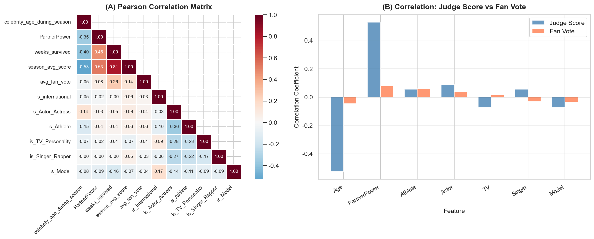
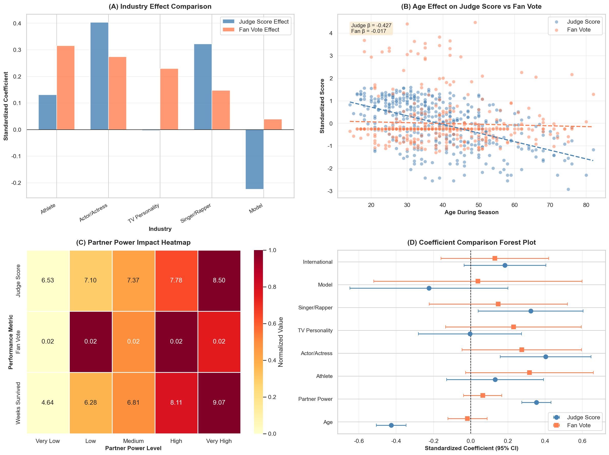

# 问题4：专业舞者与名人特征对比赛表现影响分析

## 论文写作参考文档

---

## 一、模型假设

在进行本问题的建模分析之前，我们明确以下假设：

### A. 粉丝投票重构假设（继承自问题1）

1. **淘汰规则决定性假设**：被淘汰选手的综合得分（评审百分比+粉丝投票份额）在该周所有选手中最低
2. **投票份额单纯形假设**：所有选手的粉丝投票份额之和为1，且每位选手的份额非负（$\sum f_i = 1$, $f_i \geq 0$）
3. **凸多胞体内均匀分布假设**：满足淘汰约束的可行粉丝投票分布在凸多胞体内服从均匀分布

### B. 回归分析假设

4. **线性可加性假设**：各因素对评审分数/粉丝投票的影响是线性可加的
5. **独立同分布误差假设**：回归残差独立同分布，均值为零
6. **无完全多重共线性假设**：自变量之间不存在完全的线性依赖关系

### C. 专业舞者影响假设

7. **影响力可量化假设**：专业舞者的影响力可通过其历史表现（平均得分、存活周数、决赛次数）进行量化
8. **影响路径分离假设**：专业舞者通过两条独立路径影响选手表现——技术补偿（评审分）与叙事建构（粉丝票）

### D. 名人特征假设

9. **特征稳定性假设**：名人特征（年龄、行业）在比赛期间保持不变
10. **行业效应可加假设**：各行业背景对表现的影响可通过哑变量独立建模

---

## 二、求解过程

### 2.1 数据整合

1. **主数据集**：`MCM_Problem_C_Processed.csv`（421行 × 33列）
   - 包含名人特征：年龄、行业、国际性
   - 包含表现指标：赛季平均分、存活周数
   - 包含专业舞者信息

2. **粉丝投票估计**：`问题1_批量结果_完整.csv`（228个淘汰案例）
   - 来自问题1的Hit-and-Run采样重构结果
   - 按选手汇总得到平均粉丝投票份额估计

3. **数据合并**：
   - 通过`celebrity_name`关联两个数据集
   - 有粉丝投票估计的选手：230人
   - 无估计值的选手（冠军等未淘汰者）：191人，使用中位数填充

### 2.2 专业舞者影响力指标计算（PartnerPower）

**定义**：
$$\text{PartnerPower} = 0.4 \times Z(\text{历史平均得分}) + 0.4 \times Z(\text{历史平均存活周数}) + 0.2 \times Z(\text{决赛次数})$$

其中 $Z(\cdot)$ 表示标准化变换。

**Top 5 专业舞者影响力排名**：

| 排名 | 专业舞者 | 平均得分 | 平均存活周数 | 决赛次数 | PartnerPower |
|------|----------|----------|--------------|----------|--------------|
| 1 | Derek Hough | 8.88 | 10.06 | 10 | 2.017 |
| 2 | Valentin Chmerkovskiy | 8.37 | 8.61 | 9 | 1.491 |
| 3 | Mark Ballas | 8.29 | 8.29 | 10 | 1.485 |
| 4 | Witney Carson | 8.84 | 11.00 | 1 | 1.432 |
| 5 | Cheryl Burke | 7.65 | 8.43 | 8 | 1.086 |

### 2.3 双回归模型构建

**模型1：评审分回归模型**
$$Z(J_{i}) = \beta_0 + \beta_1 \text{Age}_z + \beta_2 \text{PartnerPower}_z + \sum_{k} \beta_{3k} \text{Industry}_k + \epsilon_i$$

**模型2：粉丝投票回归模型**
$$Z(\hat{f}_{i}) = \gamma_0 + \gamma_1 \text{Age}_z + \gamma_2 \text{PartnerPower}_z + \sum_{k} \gamma_{3k} \text{Industry}_k + \eta_i$$

**样本量**：N = 421

### 2.4 Chow检验

**原理**：通过交互项方法检验两个模型的系数是否存在结构性差异。

**假设**：
- $H_0$：两个模型的系数相同（$\beta = \gamma$）
- $H_1$：两个模型的系数存在显著差异（$\beta \neq \gamma$）

**方法**：堆叠两个因变量，构建包含`X × Model`交互项的完整模型，对交互项进行联合F检验。

---

## 三、核心结果

### 3.1 模型拟合度

| 模型 | R² | 调整R² | F统计量 | p值 |
|------|-----|--------|---------|-----|
| 评审分模型 | 0.4343 | 0.4233 | 39.54 | < 0.001 |
| 粉丝投票模型 | 0.0183 | -0.0008 | 0.96 | 0.469 |

**关键发现**：评审分模型解释力强（R²=43.4%），而粉丝投票模型解释力弱（R²≈1.8%），表明评审分更受可观测特征影响，粉丝投票受更多不可观测因素驱动。

### 3.2 系数对比表

| 变量 | 评审分系数 | 显著性 | 粉丝票系数 | 显著性 | 系数差异 |
|------|-----------|--------|-----------|--------|----------|
| 年龄 (Age_z) | -0.427 | *** | -0.017 | - | -0.410 |
| 舞者影响力 (PartnerPower_z) | +0.353 | *** | +0.065 | - | +0.289 |
| 运动员 (is_Athlete) | +0.131 | - | +0.315 | * | -0.185 |
| 演员 (is_Actor_Actress) | +0.403 | *** | +0.274 | * | +0.129 |
| 电视名人 (is_TV_Personality) | -0.004 | - | +0.230 | - | -0.234 |
| 歌手 (is_Singer_Rapper) | +0.322 | ** | +0.148 | - | +0.175 |
| 模特 (is_Model) | -0.224 | - | +0.039 | - | -0.264 |
| 国际性 (is_international) | +0.184 | - | +0.130 | - | +0.054 |

注：*** p<0.01, ** p<0.05, * p<0.1

### 3.3 Chow检验结果

| 统计量 | 数值 |
|--------|------|
| F统计量 | 11.24 |
| p值 | < 0.0001 |
| 结论 | **拒绝H₀** |

**结论**：各因素对评审分和粉丝投票的影响方式存在**显著结构性差异**（p < 0.0001）。

### 3.4 交互项分析（影响差异方向）

| 变量×模型 | 系数 | p值 | 显著性 | 解释 |
|-----------|------|-----|--------|------|
| Age_z×Model | +0.410 | <0.001 | *** | 年龄对粉丝票影响弱于评审分 |
| PartnerPower_z×Model | -0.289 | <0.001 | *** | 舞者影响力对粉丝票影响弱于评审分 |
| is_Athlete×Model | +0.185 | 0.401 | - | 无显著差异 |
| is_Actor_Actress×Model | -0.129 | 0.532 | - | 无显著差异 |

---

## 四、数据可视化成果

### 图表1：相关性分析（2面板）

**文件**：`figs/问题4_相关性分析.png`



**内容**：
- (A) Pearson相关系数矩阵热力图
- (B) 各因素与评审分/粉丝票的相关系数对比条形图

**关键洞察**：
- 年龄与评审分强负相关（r = -0.53），与粉丝票弱负相关（r = -0.05）
- PartnerPower与评审分强正相关（r = 0.53），与粉丝票弱正相关（r = 0.08）

### 图表2：综合分析四图面板

**文件**：`figs/问题4_综合分析图表.png`



**Panel A - 行业效应对比条形图**：
- 演员在评审分中效应最强（β = +0.40）
- 运动员在粉丝票中效应最强（β = +0.32）
- 模特在评审分中效应为负（β = -0.22）

**Panel B - 年龄效应散点图**：
- 评审分随年龄显著下降（斜率 β = -0.427）
- 粉丝票随年龄基本不变（斜率 β = -0.017）
- 两条趋势线明显分离

**Panel C - 专业舞者影响力热力图**：
- PartnerPower从Very Low到Very High，评审分从6.53升至8.50
- 存活周数从4.64周升至9.07周
- 粉丝票份额变化不大（约0.02）

**Panel D - 系数差异森林图**：
- 年龄和PartnerPower的置信区间完全不重叠
- 运动员和演员的两模型置信区间部分重叠
- 直观展示各因素对两种评价体系的差异化影响

---

## 五、核心结论

### 5.1 专业舞者影响力

1. **对评审分**：显著正向影响（β = +0.353, p < 0.001）
   - 高水平舞者通过技术补偿提升名人表现
   - Derek Hough等顶尖舞者带队平均分可达8.88分

2. **对粉丝票**：影响不显著（β = +0.065, p = 0.220）
   - 舞者的社交媒体流量转化为粉丝票的效果有限
   - 粉丝投票更多受名人自身人气驱动

### 5.2 年龄效应

1. **对评审分**：强负向影响（β = -0.427, p < 0.001）
   - 每增加1个标准差年龄（约12.5岁），评审分下降0.43个标准差
   - 体能衰退、学习能力下降影响技术表现

2. **对粉丝票**：影响不显著（β = -0.017, p = 0.751）
   - 年长选手的"挑战自我"形象可能获得"同情票"
   - 年龄不是粉丝投票的关键考量因素

### 5.3 行业效应差异

| 行业 | 评审分优势 | 粉丝票优势 | 特点 |
|------|-----------|-----------|------|
| 运动员 | 中等 | **强** | 身体素质+竞技人气 |
| 演员 | **强** | 中等 | 舞台表现力+明星效应 |
| 歌手 | 中等 | 弱 | 节奏感好但粉丝转化有限 |
| 电视名人 | 弱 | 中等 | 曝光度高但技术一般 |
| 模特 | **负向** | 中性 | 审美优势难以转化为舞蹈技术 |

### 5.4 影响方式的结构性差异

**Chow检验结论**：各因素对评审分和粉丝票的影响方式存在**显著结构性差异**。

**差异本质**：
- **评审分**受"流利度启发式"驱动，关注技术执行的即时表现
- **粉丝票**受"叙事偏差"驱动，关注选手的成长故事和行业光环

---

## 六、论文写作建议

### 6.1 图表引用格式

```
Figure X: (A) Pearson correlation matrix showing relationships between 
celebrity characteristics and performance metrics. (B) Comparison of 
correlation coefficients between each factor and judge scores vs. fan votes.

Figure Y: Four-panel analysis showing (A) industry effect comparison, 
(B) age effect on dual metrics, (C) partner power impact heatmap, 
and (D) coefficient comparison forest plot with 95% confidence intervals.
```

### 6.2 数学公式引用

**评审分模型**：
$$Z(J_{it}) = -0.214 - 0.427 \cdot \text{Age}_z + 0.353 \cdot \text{PartnerPower}_z + \sum_k \beta_k \cdot \text{Industry}_k$$

**粉丝票模型**：
$$Z(\hat{f}_{it}) = -0.231 - 0.017 \cdot \text{Age}_z + 0.065 \cdot \text{PartnerPower}_z + \sum_k \gamma_k \cdot \text{Industry}_k$$

### 6.3 关键统计数据引用

- 样本量：N = 421 名选手
- 评审分模型 R² = 43.4%
- Chow检验 F = 11.24, p < 0.0001
- 年龄效应差异：Δβ = -0.410 (p < 0.001)
- PartnerPower效应差异：Δβ = +0.289 (p < 0.001)

---

## 七、附录：数据文件清单

| 文件名 | 路径 | 说明 |
|--------|------|------|
| 问题4_相关性分析.png | figs/ | 相关性分析双面板图 |
| 问题4_综合分析图表.png | figs/ | 综合分析四图面板 |
| 问题4_系数对比表.csv | results/ | 双模型系数对比表 |
| 问题4_专业舞者影响力排名.csv | results/ | 62位专业舞者PartnerPower排名 |
| 问题4_模型摘要.csv | results/ | 模型拟合度统计 |
| 问题4_专业舞者与名人特征分析.ipynb | ./ | 完整分析代码 |

---

*文档生成时间：2026年1月30日*
