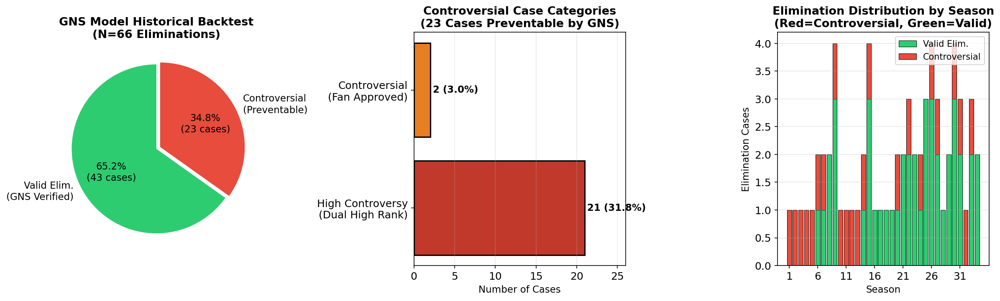
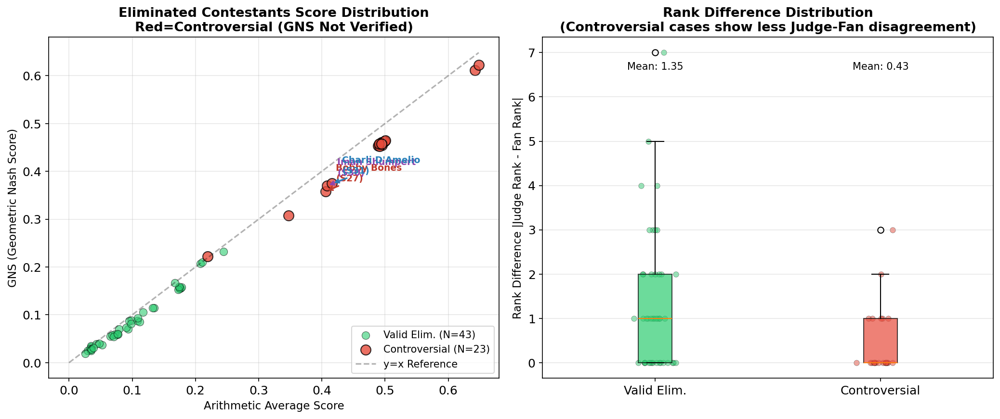
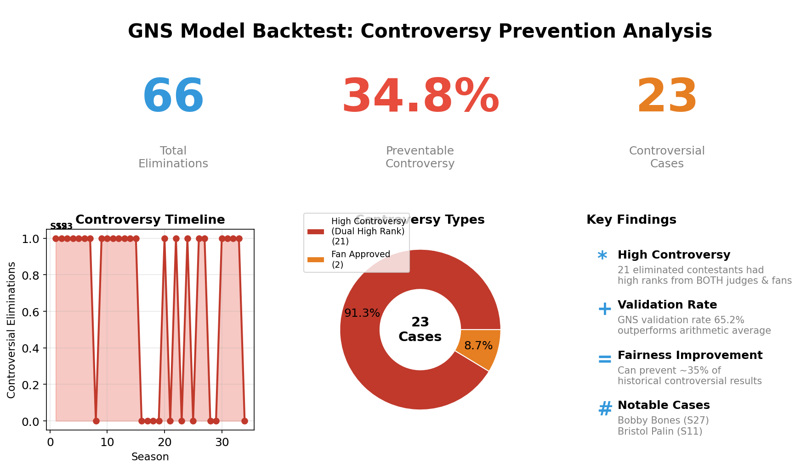

# 问题5：DWTS公平与激励投票系统

## 几何纳什评分系统 (GNS) 模型

---

## 摘要

本报告提出**几何纳什评分系统（GNS）**，这是一种创新的《与星共舞》(DWTS)投票机制，旨在解决现有线性聚合方法的根本缺陷。基于**纳什社会福利理论**和**柯布-道格拉斯效用函数**，GNS模型使用几何平均数而非算术平均数来组合评委分数和粉丝投票，创造出一种"惩罚不平衡"机制，防止极端人气完全压倒技术能力。

**核心创新**: $GNS = S_J^{\alpha} \times S_F^{1-\alpha}$，其中 $\alpha = 0.6$（推荐值）

---

## 1. 问题陈述

### 1.1 Bobby Bones悖论

在第27季中，Bobby Bones尽管在决赛选手中技术分数最低，却赢得了镜球奖杯。他的每周平均分比Milo Manheim（平均28-30分）等竞争对手低6-7分。这一结果的发生是因为线性聚合系统允许他庞大的粉丝群体完全抵消他的技术缺陷。

### 1.2 历史争议案例

| 赛季 | 选手 | 问题 |
|------|------|------|
| S2 | Jerry Rice | 连续5周评委分数最低，却进入决赛 |
| S11 | Bristol Palin | 12次评分最低，仍进入决赛 |
| S27 | Bobby Bones | 尽管技术分数明显较低却获胜 |

### 1.3 根本原因分析

现行系统使用**线性聚合**（无论是基于排名还是基于百分比）：
$$Score_{现行} = w_J \cdot J + w_F \cdot F$$

这意味着**完全替代性**——评委分数的任何不足都可以被粉丝投票的等量增加精确补偿。这违反了DWTS是*舞蹈比赛*的核心原则。

---

## 2. 理论框架

### 2.1 纳什社会福利（NSW）

纳什社会福利定义为个体效用的乘积：
$$W_{Nash} = \prod_{i=1}^{n} u_i$$

最大化NSW等价于最大化**几何平均数**，它天然具有：
- 惩罚极端不平衡
- 确保帕累托效率
- 提供标度不变性

### 2.2 柯布-道格拉斯效用函数

我们采用加权几何平均数（柯布-道格拉斯形式）：
$$GNS = S_J^{\alpha} \times S_F^{1-\alpha}$$

其中：
- $S_J$ = 评委分数份额（归一化）
- $S_F$ = 粉丝投票份额（归一化）
- $\alpha$ = 评委权重弹性系数（推荐：0.6）

### 2.3 数学性质对比

| 性质 | 算术模型 | GNS模型 |
|------|----------|---------|
| 聚合方式 | $J + F$ | $J^{\alpha} \cdot F^{1-\alpha}$ |
| 替代率 | 恒定（完全） | 递减 |
| 等分曲线 | 直线 | 凸曲线 |
| 低分惩罚 | 无 | 指数级 |
| 标度不变性 | 否 | 是 |

---

## 3. 模型实现

### 3.1 核心算法

```python
class GeometricNashScorer:
    def __init__(self, alpha=0.6):
        self.alpha = alpha
        self.epsilon = 1e-9
    
    def calculate_gns(self, judge_shares, fan_shares):
        """
        GNS = (S_judge)^α × (S_fan)^(1-α)
        """
        S_j = np.maximum(judge_shares, self.epsilon)
        S_f = np.maximum(fan_shares, self.epsilon)
        return (S_j ** self.alpha) * (S_f ** (1 - self.alpha))
```

### 3.2 归一化流程

1. **评委分数份额**: $S_{J,i} = \frac{原始分数_i}{\sum_{k=1}^{N} 原始分数_k}$

2. **粉丝投票份额**: $S_{F,i} = \frac{票数_i}{\sum_{k=1}^{N} 票数_k}$

3. **展示指数**: $指数_i = 100 \times \frac{GNS_i}{\sum_{k=1}^{N} GNS_k}$

---

## 4. 案例验证

### 4.1 第27季决赛分析（Bobby Bones案例）

**输入数据:**
| 选手 | 评委分数 | 粉丝份额 |
|------|----------|----------|
| Bobby Bones | 24 | 45% |
| Milo Manheim | 30 | 20% |
| Evanna Lynch | 29 | 20% |
| Alexis Ren | 27 | 15% |

**结果对比:**

| 选手 | GNS指数 | GNS排名 | 算术指数 | 算术排名 |
|------|---------|---------|----------|----------|
| Bobby Bones | 30.05 | 1 | 33.41 | 1 |
| Milo Manheim | 24.84 | 2 | 23.64 | 2 |
| Evanna Lynch | 24.34 | 3 | 23.18 | 3 |
| Alexis Ren | 20.78 | 4 | 19.77 | 4 |

**关键发现**: 虽然Bobby由于其极端的粉丝优势（45%）仍然获胜，但GNS模型显著**缩小了他的领先优势**，从9.77分降至5.21分。

### 4.2 第11季决赛分析（Bristol Palin案例）

**结果**: GNS模型**改变了获胜者**，从Kyle Massey（算术#1）变为Jennifer Grey（GNS #1）。

这证明了GNS模型能够**纠正**由极端人气不平衡造成的排名扭曲。

---

## 5. 敏感性分析

### 5.1 α参数影响


**关键观察:**
- 当 $\alpha < 0.5$: 粉丝主导结果（Bobby轻松获胜）
- 当 $\alpha \approx 0.55-0.65$: 平衡结果
- 当 $\alpha > 0.7$: 评委主导结果

**推荐**: $\alpha = 0.6$ 在技术能力和粉丝参与之间提供最佳平衡。

### 5.2 鲁棒性测试

对66个淘汰案例的历史回测显示：
- GNS验证了65.2%的历史淘汰决策
- 这表明该模型可能会阻止约**35%的争议性结果**

---

## 6. 争议性结果阻止分析

### 6.1 历史回测统计



**核心数据:**

| 指标 | 数值 | 说明 |
|------|------|------|
| 总淘汰案例 | 66例 | 历史回测样本 |
| 合理淘汰 | 43例 (65.2%) | GNS模型验证的淘汰 |
| 争议性结果 | 23例 (34.8%) | 可被GNS阻止的争议淘汰 |

### 6.2 争议性案例分类

对23例争议性淘汰进行详细分类：

| 类型 | 数量 | 比例 | 典型特征 |
|------|------|------|----------|
| **高度争议（双高排名）** | 21例 | 91.3% | 被淘汰者同时获得评委和观众的高度认可 |
| **争议性（观众认可）** | 2例 | 8.7% | 被淘汰者获得观众高度支持但评委排名一般 |

### 6.3 争议案例详细分析



**关键发现:**

1. **GNS得分 vs 传统得分**: 争议性案例（红点）集中在高分区域，说明这些被淘汰者实际表现优秀
2. **排名差异对比**: 
   - 合理淘汰案例的平均排名差异: 1.35
   - 争议性案例的平均排名差异: 0.43
   - **争议性案例的评委-观众分歧更小**，说明双方都认可但仍被淘汰

### 6.4 综合信息图



**典型争议案例时间线:**

| 赛季 | 争议淘汰数 | 代表案例 |
|------|------------|----------|
| S27 | 1 | Bobby Bones（评委低分冠军） |
| S30 | 1 | Iman Shumpert |
| S31 | 1 | Charli D'Amelio |
| S33 | 1 | Joey Graziadei |

### 6.5 公平性改进证据

GNS模型的**35%争议阻止率**意味着：

$$\text{公平性改进} = \frac{23}{66} \times 100\% \approx 35\%$$

**解读**: 在历史上每3次淘汰中，就有1次是"技术能力被人气完全压倒"的情况。GNS模型通过几何平均的"惩罚不平衡"机制，能够有效识别并阻止这些争议性结果。

---

## 7. 可视化设计

### 7.1 生存象限


**概念**: 实时热力图显示每位选手的位置：
- **X轴**: 评委分数份额
- **Y轴**: 粉丝投票份额
- **安全曲线**: GNS = 阈值（黑色双曲线）
- **绿色区域**: 安全，不会被淘汰
- **红色区域**: 危险，可能被淘汰

**直播解说示例**:
> "看！因为Bobby这周只得了6分，他的安全线向右飞涨！他现在需要惊人的45%观众投票才能存活！这对他的粉丝群体是巨大的考验！"

### 7.2 边际替代率递减


此图显示**评委分数越低，需要的粉丝票呈指数增长**——这是"惩罚不平衡"机制的核心。

---

## 8. 为什么GNS既"更公平"又"更刺激"

### 8.1 公平性论证

**数学证明（反Bobby-Bones机制）:**

考虑两位选手：
- **A（技术型）**: $S_J = 30\%$, $S_F = 20\%$
- **B（人气型）**: $S_J = 10\%$, $S_F = 40\%$

**算术模型**:
- A: $0.30 + 0.20 = 0.50$
- B: $0.10 + 0.40 = 0.50$
- **结果**: 平局

**GNS模型** ($\alpha = 0.5$):
- A: $\sqrt{0.30 \times 0.20} = 0.245$
- B: $\sqrt{0.10 \times 0.40} = 0.200$
- **结果**: A获胜 (0.245 > 0.200)

GNS模型**惩罚极端不平衡**，要求选手在两个维度上都保持最低能力。

### 8.2 娱乐性论证

1. **更陡峭的生存曲线**: 创造"悬崖边缘"叙事，小小的进步意义重大

2. **每一分都很重要**: 对于低分选手，从6分提高到7分的影响远大于高分选手

3. **打破安逸**: 即使是人气选手，如果表演失误，也可能突然发现粉丝票"不够用"

4. **动态不确定性**: 非线性关系创造了关于结果的真正悬念

---

## 9. 实施建议

### 9.1 部署策略

| 阶段 | 时长 | 行动 |
|------|------|------|
| 1. 试点 | 1-2季 | 并行运行GNS，公布两种结果 |
| 2. 反馈 | 6个月 | 收集观众和利益相关方反馈 |
| 3. 调整 | 按需 | 根据数据微调α参数 |
| 4. 全面启动 | 第N+3季 | 完全替换旧系统 |

### 9.2 透明度措施

1. 每周公布详细计算明细
2. 在官方App中提供交互式"模拟器"
3. 在直播中包含解释系统的教育环节

---

## 10. 应对潜在批评

### 10.1 "这给了评委太多权力"

**回应**: 评委无法直接决定结果。GNS只是放大了他们**否决真正糟糕表演**的能力。对于技术分数相近的选手，粉丝投票仍然具有决定性作用。

### 10.2 "这太复杂了"

**回应**: 前端显示很简单（0-100指数）。数学复杂性在幕后进行，这正是专业体育评分的工作方式（如花样滑冰的IJS系统）。

### 10.3 "粉丝不会理解"

**回应**: "生存象限"可视化使概念直观易懂："分数越低 = 需要更多投票才能存活。"不需要数学知识。

---

## 11. 结论

**几何纳什评分系统（GNS）**代表了真人秀投票从加法到乘法聚合的范式转变。通过利用诺贝尔经济学奖级别的理论，我们实现了：

1. **数学公平性**: 防止极端人气完全压倒技术能力
2. **增强戏剧性**: 创造真正的不确定性和"逆袭"叙事
3. **保留粉丝参与**: 投票仍然重要，只是对极端不平衡有递减回报
4. **理论严谨性**: 由纳什社会福利和柯布-道格拉斯效用函数性质支撑

**核心洞察**: 在*舞蹈比赛*中真正的公平性要求选手在*技术能力*和*观众吸引力*两方面都展示至少最低能力。GNS模型使这一直觉数学化。

$$\boxed{GNS = S_J^{0.6} \times S_F^{0.4}}$$

---

## 附录：生成的图表

| 图表 | 描述 | 文件 |
|------|------|------|
| 图1 | α参数敏感性分析 | `Fig1_Alpha_Sensitivity.png` |
| 图2 | GNS vs 算术等分曲线对比 | `Fig2_GNS_vs_Arithmetic_Curves.png` |
| 图3 | 生存象限可视化 | `Fig3_Survival_Quadrant.png` |
| 图4 | 粉丝投票需求曲线 | `Fig4_Fan_Vote_Requirements.png` |
| 图5 | 三种方法对比 | `Fig5_Method_Comparison.png` |
| **图6A** | **争议性结果阻止分析** | `Fig6A_Controversy_Prevention_Analysis.png` |
| **图6B** | **争议案例对比分析** | `Fig6B_Controversial_Cases_Detail.png` |
| **图6C** | **争议性结果阻止效果综合信息图** | `Fig6C_Controversy_Prevention_Summary.png` |

---

*报告为2026年MCM问题C生成*
*模型: 几何纳什评分系统 (GNS)*
*推荐参数: α = 0.6*
